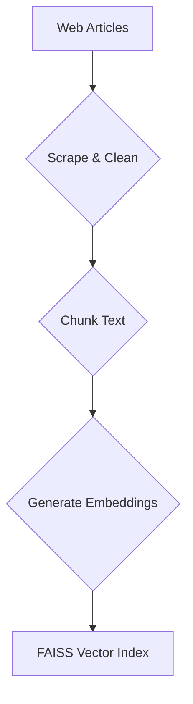
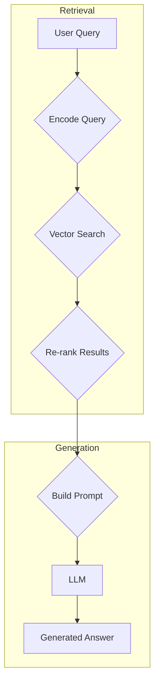

# **RAG System for Geographical Q&A**

[](https://www.python.org/downloads/)
[](https://fastapi.tiangolo.com/)
[](https://streamlit.io/)

### **Project Overview**

This repository contains a complete, end-to-end Retrieval-Augmented Generation (RAG) system built from scratch. The system is designed to answer questions about the geography of France by leveraging a knowledge base created from Britannica articles. It features a modular architecture, a robust data ingestion pipeline, and a high-performance API powered by FastAPI.

This project serves as a comprehensive demonstration of modern RAG techniques, including advanced retrieval strategies and quantitative performance evaluation.

---

### **System Architecture**

The project is divided into two main pipelines: an offline **Ingestion Pipeline** for data processing and an online **Inference Pipeline** for handling user queries.

**1. Ingestion Pipeline (Offline)**


**2. Inference Pipeline (Online)**


---

### **Key Features**

-   **End-to-End RAG Pipeline:** From web scraping with `BeautifulSoup` to final answer generation.
-   **Hybrid Retrieval:** Combines semantic vector search (`FAISS`) with metadata filtering.
-   **Re-ranking:** Utilizes a Cross-Encoder (`ms-marco-MiniLM-L-6-v2`) for enhanced precision.
-   **Asynchronous API:** Built with FastAPI and `httpx` for high-performance, non-blocking I/O.
-   **Built-in Evaluation Suite:** Quantitatively measure system performance on key RAG metrics.
-   **Interactive UI:** A simple web interface powered by `Streamlit` for easy demonstration.

---

### **Project Structure**
```
.
├── data/                    # Stores FAISS index, chunk data, and evaluation sets.
├── main.py                  # FastAPI server: API endpoints (/retrieve, /generate).
├── ingestion.py             # Offline script for data scraping, processing, and indexing.
├── retrieval.py             # Core logic for vector search and metadata filtering.
├── re_ranking.py            # Logic for the Cross-Encoder re-ranking step.
├── generation.py            # Handles LLM prompt construction and API calls.
├── evaluate.py              # Script to measure RAG quality (recall, faithfulness, etc.).
├── run_final_evaluation.py  # Script to generate the final 40-question output file.
├── verify_evals.py          # Script to validate the structure of the final output.
├── ui.py                    # Streamlit application for the interactive web UI.
├── config.py                # Central configuration for models, paths, and settings.
├── requirements.txt         # Project dependencies.
└── .env.example             # Template for environment variables.
```

---

## **Setup Guide**

### **1. Prerequisites**

-   [Git](https://git-scm.com/)
-   [Python 3.9+](https://www.python.org/downloads/)
-   A [Together AI](https://api.together.xyz/) API Key

### **2. Installation**

First, clone the repository and set up your Python virtual environment.

```bash
# Clone the repository
git clone https://github.com/your-username/your-repo-name.git
cd your-repo-name

# Create and activate the virtual environment
python -m venv venv
# On macOS/Linux:
source venv/bin/activate
# On Windows:
.\venv\Scripts\activate

# Install all required dependencies
pip install -r requirements.txt
```

### **3. Environment Setup**

Create a `.env` file and add your Together AI API key.

```bash
# Create the .env file from the example
cp .env.example .env

# Now, open the .env file and add your key:
# TOGETHER_API_KEY="your_together_ai_api_key_here"
```

---

## **How to Use**

The system operates in three stages: **Ingestion**, **Running the API**, and **Interacting**.

### **Stage 1: Ingestion (Run this once)**

This script scrapes the data, processes it, and creates the local vector index.

```bash
python ingestion.py
```
This will create a `data/` directory containing the FAISS index and chunk data.

### **Stage 2: Run the API Server**

Start the FastAPI server to host the RAG pipeline.

```bash
uvicorn main:app --reload
```
The API is now live at `http://127.0.0.1:8000`.

### **Stage 3: Interact with the System**

You have two ways to interact with the running RAG system:

#### **A) Interactive UI (Recommended for Demo)**

In a **new terminal**, run the Streamlit application.

```bash
streamlit run ui.py
```
Open your browser to the local URL provided by Streamlit (usually `http://localhost:8501`).

#### **B) API Endpoints**

Interact directly with the API via the auto-generated documentation at **`http://127.0.0.1:8000/docs`**.

<details>
<summary><strong>Click to see an example API request for /generate</strong></summary>

Send a `POST` request to `http://127.0.0.1:8000/generate` with the following JSON body:

```json
{
  "query": "Describe the climate in the great lowlands of France.",
  "top_k": 3,
  "use_reranker": true,
  "category_filter": "Climate"
}
```
</details>

---

## **Evaluation Suite**

The project includes two forms of evaluation: **quality measurement** and **structural validation**.

### **1. Measuring RAG Quality**

The `evaluate.py` script measures the performance of the RAG pipeline against a ground-truth dataset.

**How to Run:**
```bash
# Run on a default of 5 questions
python evaluate.py

# Run on a specific number of questions (e.g., 10)
python evaluate.py --num_questions 10
```

The script prints a summary to the console and saves a detailed `evaluation_report.csv`.
<details>
<summary><strong>Click to see example evaluation output</strong></summary>

```
--- RAG Evaluation Summary ---
Total Questions Evaluated: 5
context_recall       0.200000
faithfulness         0.800000
answer_similarity    0.892671
----------------------------
```
</details>

### **2. Validating Final Output Structure**

For a specific deliverable, the `run_final_evaluation.py` script generates answers for 40 questions and formats them into a specific JSON structure. The `verify_evals.py` script then validates this output.

**How to Run:**
```bash
# 1. Generate the final output file
python run_final_evaluation.py

# 2. Verify the structure of the generated file
python verify_evals.py my_final_output.json
```
**Expected Success Message:** `✓ 'my_final_output.json' has valid structure`

---

## **License**

This project is licensed under the MIT License. See the `LICENSE` file for details.